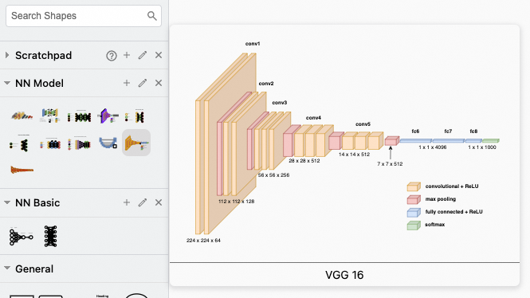
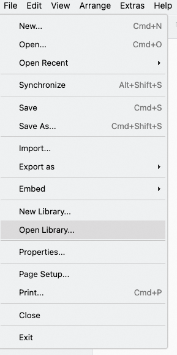

# drawio-nn-templates

A collection of meticulously crafted neural network architecture templates for Draw.io, designed to help you effortlessly design and visualize neural network models. Simply import and use them without the hassle of drawing complex network structures from scratch.

## Features
- Easy to Import: Templates are optimized for direct import into Draw.io.
- Rich Architectures: Includes common neural network structures such as Convolutional Neural Networks (CNNs), Recurrent Neural Networks (RNNs), Deep Belief Network (DBN), and more.
- Highly Customizable: All templates can be modified and expanded to meet the needs of different projects.
- Increased Efficiency: Save drawing time and focus more on model design and optimization.

## Quick Start
1. Download Templates: Clone or download this repository.
2. Import into Draw.io: In Draw.io, select File -> Open Library, then choose the template file you need.
Edit and Customize: Modify and refine the templates according to your project requirements.

## Contribution
We welcome issues and pull requests to improve this project. Your contributions will help more developers efficiently design neural network architectures.

## License
This project is open-sourced under the MIT License.

By using these easy-to-import Draw.io neural network architecture templates, you can focus on innovation and optimization of your models without spending time on drawing. Start now and boost your development efficiency!
